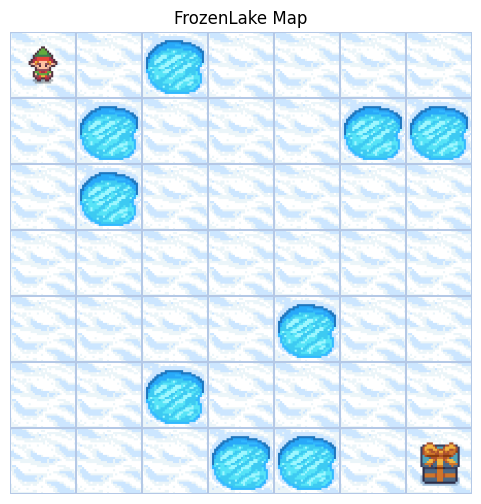
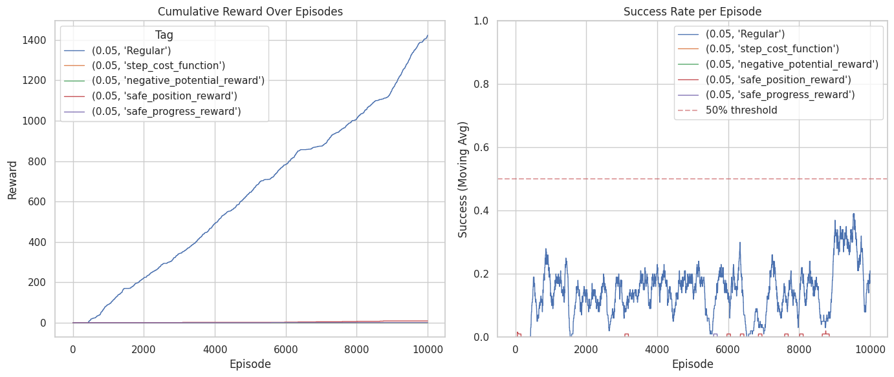
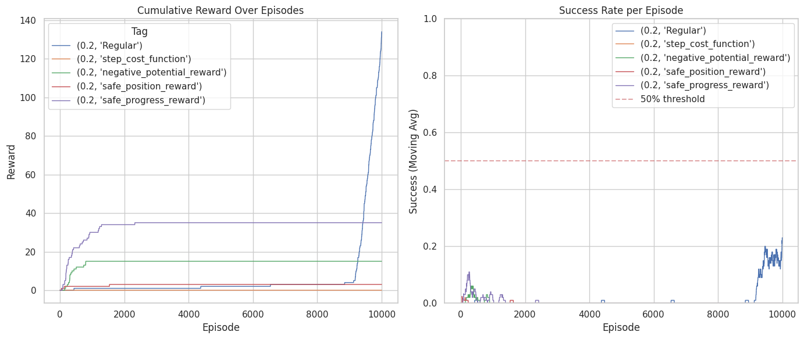

# Reward Shaping Analysis in FrozenLake

> A comparative study of reward shaping strategies on Monte Carlo Control and SARSA(0) algorithms in the stochastic FrozenLake environment.

---

## 🎯 Project Overview

This project investigates how different reward shaping strategies affect learning efficiency in reinforcement learning. We implement and compare two RL algorithms—**Every-Visit Monte Carlo Control** and **SARSA(0)**—across multiple reward shaping approaches in the FrozenLake environment.



*Our custom 8×8 FrozenLake grid with ~15% hole density. The agent starts at the top-left corner and must navigate to the goal (gift box) at the bottom-right while avoiding holes (blue circles).*

---

## 🧪 Reward Shaping Strategies

| Strategy | Description |
|----------|-------------|
| **Baseline (No Shaping)** | Original FrozenLake reward: +1 for goal, 0 otherwise |
| **Step-Cost** | Small penalty (-0.01) per step to encourage efficiency |
| **Potential-Based Distance** | Uses Manhattan distance to goal as potential function |
| **Safe Position** | Rewards positions far from holes (custom) |
| **Safe Progress** | Combines progress + safety + step penalty (custom) |

---

## 📊 Key Results

### Monte Carlo Control (ε = 0.05)


### SARSA(0) (ε = 0.2)


---

## 🔬 Key Findings

1. **No reward shaping performed best** with Monte Carlo in the stochastic environment
2. **All custom reward shaping strategies failed** to improve over baseline
3. **Exploration (ε) is critical** when using reward shaping
4. **Stochastic environments require careful reward design**—strategies effective in deterministic settings can fail when actions have uncertain outcomes

---

## 🚀 Quick Start

### Requirements
```bash
pip install gymnasium numpy matplotlib seaborn pandas tqdm
```

### Running the Notebook
1. Open `RL_Project_Reward_Shaping.ipynb` in Google Colab
2. Run all cells sequentially
3. Results and plots will be generated automatically

### Environment Configuration
- **Grid Size**: 8×8 custom map
- **Slippery**: True (`success_rate = 0.7`)
- **Discount Factor (γ)**: 1.0
- **Training Episodes**: 10,000

---

## 📁 Project Structure

```
├── RL_Project_Reward_Shaping.ipynb   # Main notebook with all implementations
├── README.md                          # This file
├── map.png                            # FrozenLake grid visualization
├── MC_graphs1.png                     # Monte Carlo results
└── SARSA0Graph1.png                   # SARSA results
```

---

## 🛠️ Implementation Details

### Algorithms
- **Every-Visit Monte Carlo Control**: Constant-α learning with ε-greedy exploration
- **SARSA(0)**: TD(0) on-policy control with ε-greedy action selection

### Wrappers
- `MetricsWrapper`: Tracks episode metrics (returns, lengths, success rate, throughput)
- `RewardShapingWrapper`: Applies configurable reward shaping functions

---

## 📚 References

- [Gymnasium FrozenLake Documentation](https://gymnasium.farama.org/environments/toy_text/frozen_lake/)
- Ng, A. Y., Harada, D., & Russell, S. (1999). *Policy invariance under reward transformations: Theory and application to reward shaping*

---

## 👥 Authors

Reinforcement Learning Course Project
